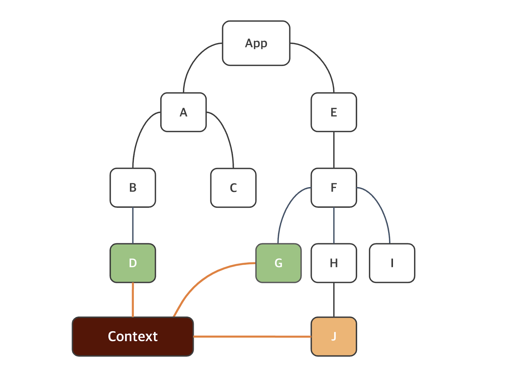

## JSX와 스타일링

JSX : 자바스크립트를 위한 확장 문법. 리액트에서 JSX를 반드시 이용해야 하는 것은 아니지만 개발을 더 쉽게 만들어주는 이점이 있기 때문에 장기적으로 익히는게 이롭습니다.

예를 들어, JSX는 모든 값이 렌더링 되기 전에 JSX에서 이스케이프되므로 주입(Injection) 공격을 방지할 수 있음.
중괄호를 통해 자바스크립트 표현식을 감싸서 JSX에 포함시킬 수 있다는 점.

### props

: 속성(Properties)의 축약어로, 상위 컴포넌트에서 하위 컴포넌트로 데이터를 전달하는 데 사용되는 방식(React의 특징 어제 학습했습니다). 상위 컴포넌트는 하위 컴포넌트를 호출할 때, 해당 컴포넌트에 필요한 데이터를 props를 통해서 전달합니다. 이 데이터는 __'키 - 값 쌍'__으로 구성되며, 다양한 자료형을 포함할 수 있습니다. 하위 컴포넌트는 props를 받아와 컴포넌트 내부에서 사용합니다(마치 매개변수처럼 사용한다는 의미가 됩니다). props는 함수 매개변수처럼 컴포넌트 함수의 argument로 전달되며, 컴포넌트 내부에서 props를 참조하여 데이터를 사용합니다.

#### props 예시 코드
```jsx
//상위 컴포넌트
function ParentComponent() {
  return (
    <ChildComponent
      name="John"
      message="Hello from Parent!"
    />
  );
}

//하위 컴포넌트
function ChildComponent(props) {
  return (
    <div>
      <h2> {props.name} </h2>   {/* John */}
      <p> {props.message} </p>  {/* Hello from Parent! */} 
    </div>
  );
}
```

// function Hello1() {
//   return <h1>Hello, Everyone?🎈</h1>
// }

// export default Hello1

// function Hello2(props) {
//   return <h1>Hello {props.user}</h1>
// }

// export default Hello2

// 이상의 코드는 현재 상황에서는 문제가 생기는데, 이제 여러분들이 주의해야 할 점 중에 하나는 개발자 도구에서 잘못된 부분을 확인했을 때 main.jsx의 다섯 번째 줄이 문제라고 되어있는데 사실은 Hello 함수가 argument를 가지지만 현재 기준 12번 라인에서 <Hello /> 부분에 props와 관계된 부분이 작성되어있지 않아서입니다.

// 즉 여러분들은 자바 배울 때 객체 지향 하면서 파일 넘나들면서 오류 수정했던 부분들을 JavaScript에서 잠깐 놓아두셨지만(index에 script 추가했냐 정도만 하셨지만) 이제는 React 상황에서 여러 파일을 검증해서 오류를 밝혀내야 할 필요가 있습니다.

// main.jsx -> 상위 컴포넌트로서 키-값 쌍을 정의하고(user라는 키와 Ahn이라는 값) 하위 컴포넌트인 Hello로 전달

// 그 때 props = {user: 'Ahn'}으로 대입되며, 이후 <h1>Hello {props.user}</h1>은 Hello Ahn으로 출력되게 됩니다.

// function Hello3(props) {
//   return <h1>Hi {props.firstName} {props.lastName}</h1>
// }

// export default Hello3

// main.jsx를 적절히 수정하여 로버트 패틴슨 으로 출력될 수 있도록 작성하시오.

// 이상의 코드가 의미하는 바는 : props 내의 복수의 키-값 쌍(properties)가 있을 수 있음을 보여줍니다.

// 그리고 20250225에 배운 객체의 구조분해를 이용할 수도 있습니다.

function Hello4( { firstName, lastName }) {
  return <h1>Hello {firstName} {lastName} </h1>
}

export default Hello4

### State

: State는 리액트에서 사용하는 '일반 자바스크립트 객체'이며 렌더링 결과물에 영향을 주는 데이터를 가지고 있으며, 
함수 내에서 선언된 state는 각 컴포넌트 안에서 관리합니다. 

state는 onClick 같은 사용자 이벤트 또는 네트워크 '상태에 따라 변경'될 수 있습니다. 컴포넌트가 마운트(추후 수업)될 때 state의 기본 값으로 시작하고, 컴포넌트에서 자체적으로 state를 관리하지만 초기 상태를 설정하는 것 말고는 하위 컴포넌트의 state를 변경할 수 있는 권한이 없습니다.

즉, state는 하위 컴포넌트에서 직접 변경하는 것은 권장되지 않고, 만약 state의 값을 변경해야 한다면 해당 컴포넌트 내부에서
setState()를 사용해야 합니다.(추후 수업 예정)

- 리액트에서 컴포넌트 상태(State)는 시간의 변화에 따라 변경될 수 있는 정보를 보관하는 
내부 데이터 저장소에 해당함. 컴포넌트의 렌더링에도 영향을 줍니다.

- 상태가 업데이트되면(상태값이 바뀌면) 리액트는 컴포넌트의 리렌더링을 시도합니다(변경 사항이 생길 때마다 
지가 알아서 업데이트를 해줬으니까요). 컴포넌트의 리렌더링이 끝나게 되면 상태는 최신 값을 유지하게 되는데, 
이러한 특성으로 컴포넌트가 사용자 상호작용이나 기타 이벤트에 '동적'으로 반응할 수 있도록 합니다.

* 주의 사항 :
- 일반적으로 리액트 컴포넌트에 불필요한 상태를 도입하지 않는 것이 좋다 

-> 불필요한 상태가 컴포넌트의 내부 로직의 복잡성을 증가시키기 때문에 예상치 못한 에러 발생

-> 그런 경우 지역 변수를 도입하는 것이 대안이 될 수는 있습니다.

-> 근데 지역변수의 변경은 컴포넌트의 리렌더링을 만들지 않습니다.

-> 그렇다고 해서 강제로 리렌더링을 유도하면 지역 변수는 초기값으로 바뀌겠죠.

상태는 useState 훅 함수를 이용하여 만들 수 있다(훅 함수 개념은 아마 내일 쯤 수업 예정). 
해당 함수는 상태의 초깃값인
argument를 하나 받고 두 요소로 구성된 '배열'을 반환한다.
첫 번째 argument는 상태의 이름
두 번째 argument는 상태 값을 업데이트하는데 이용되는 함수에 해당함

형식 :

```jsx
const [state, setState] = React.useState(intialValue)
```

예를 들어 상태의 이름이 name이고, 초기값이 Robert인 상태 변수를 생성한다면

```jsx
const [name, setName] = React.useState('Robert');
```

위의 형식과 예제를 비교하여 useState()함수를 사용하는데 익숙해지시면 좋겠습니다.

근데 매번 React.을 쓰는게 번거로운 경우에 미리 import를 시키는 방법이 있는데

```jsx
import React, { useState } from 'react';

const [name, setName] = useState('Robert');

// name 속성의 속성값을 바꾸고 싶다면
setName('Rob');

name = 'Ray'; // 직접 바꾸는 방식이 있을 수 있는데
// 이상의 경우 UI 리렌더링이 일어나지 않습니다.
```


// firstName과 lastName이라는 상태를 만들기 위해서 코드를
// 한 번 작성해보겠습니다 .md 파일을 참조해서 일단 작성하고
// 후에 저와 같이 풀이하고 적용해보겠습니다.
// firstName의 초기값 : Junho
// lastName의 초기값 : Bong

// 상태를 업데이트하세요 Captain America로

// import React, {useState} from 'react';

// const [ firstName, setFirstName ] = useState('Junho');
// const [ lastName, setLastName ] = useState('Bong');

// setFirstName('Captain');
// setLastName('America');

/**
 * 혹은 여러 개의 const를 작성해서 속성마다 정의하는 것이 아니라
 * 객체의 형태로 정의할 수도 있습니다.
 */

// const [name, setName] = useState({
//   firstName: 'Junho',
//   lastName: 'Bong',
// });

// setName을 사용하게 될 경우의 차이점이 있습니다.
// setName({firstName: 'Captain', lastName:'America'});

// 즉 name, setName을 통해서 useState의 매개변수가 객체형태로 고정되어있으므로,
// setName의 argument 또한 객체가 들어가야합니다.
// 이상을 이유로 lastName만 수정하고 싶어도 전부 다 바꿔줘야하거나
// 초기값을 동일하게 집어넣어줘야하는 귀찮은 일이 있습니다.

// 객체의 부분 업데이트를 하기 위한 방법 :

// spread : ES2018 객체 스프레드 구문을 이용하여 name 상태 객체를 복제하고, firstName의 값을 '이등병'으로 업데이트 한다면

// setName({... name, firstName: '이등병'});

// import {useState} from 'react';
// function App3() {
//   const [ name, setName ] = useState({
//     firstName: '크리스',
//     lastName: '에반스',
//   })

//   return <div>안녕 {name.firstName} {name.lastName}</div>;
// }

// export default App3

### 상태 비저장 컴포넌트

: React 상태 비저장 컴포넌트(Stateless Component)는 프롭을 argument로 받아
리액트 요소를 반환하는 순수 자바스크립트 함수에 해당합니다.

```jsx
function HeaderText(props) {
  return (
    <h1>
      {props.text}
    </h1>
  );
}

export default HeaderText
```

이상의 예제 컴포넌트는 순수 컴포넌트(Pure Component)라고 합니다.
동일한 입력값이 주어졌을 때 리턴값이 동일한 컴포넌트를 의미합니다.
리액트는 순수 '함수 컴포넌트'의 성능을 최적화하는 React.memo()를 제공하는데
메모이제이션이라는 개념인데, 실습하면서 하겠습니다.

App4.jsx만들겠습니다.

import React, { memo } from 'react';

function HeaderText(props) {
  return (
    <h1>
      {props.text}
    </h1>
  );
}

export default memo(HeaderText);

/**
 * 이제 컴포넌트가 렌더링되고 '메모이제이션'된다. 다음 렌더링에서 리액트는 프롭값이 변동되지 않으면 메모된 결과를 렌더링합니다. 변동이 있으면 업데이트하고, 변동이 없다면 메모된 그대로 렌더링한다는 의미. 
 * React.memo() 함수에 렌더링 조건을 사용자 정의하는 데 이용할 수 있는 두 번째 argument인 arePropsEqual()도 있기는 한데, 추후 사용할 예정.
 * 
 * 함수 컴포넌트 방식을 사용할 때 얻을 수 있는 이점 중 하나는 동일한 입력값에 대해 반환값이 항상 동일하기 때문에 단위 테스트가 간단하는 점이 있습니다.
 * 
 * 조건부 렌더링
 */


 ### 조건부 렌더링

 : 조건문을 이용하여 조건이 true / false일 때 다른 UI를 렌더링할 수 있다
 (저희는 vanilla JS로 짰습니다 signin 페이지와 signup페이지로).
 해당 기능은 일부 요소를 표시하거나 숨기고 인증을 처리하는 등의 작업에
 이용 가능합니다.

 ```jsx
function MyComponent(props) {
  const isLoggedIn = props.isLoggedIn;

  if (isLoggedIn) {
    return (
      <Logout />
    )
  }

  return (
    <Login />
  )
}
 ```

 // 동일한 구조라고 가정했을 때 결국 if - else 구문이니까
 // 우리는 위의 코드를 축약시킬 수 있을 겁니다. -> _ _ _ _ _

 삼항연산자 적용 코드

 ```jsx
function MyComponent(props) {
  const isLoggedin = props.isLoggedin;
  return (
    <>
      {isLoggedin ? <Logout /> : <Login />}
    </>
  )
}
 ```

 ## React Hook

 : 훅(Hook)은 React 16.8부터 도입된 기능으로, 함수 컴포넌트에서
 상태와 리액트의 다른 기능을 이용하는데 사용됩니다. 

 훅 이전에는 복잡한 컴포넌트 로직이 있는 경우 클래스 컴포넌트를 사용해야만
 했었는데, 이를 통해 함수형 프로그래밍의 작성에 큰 도움을 주었습니다.

 -> 배우기는 좀 어려웠습니다.

 - 리액트에서 훅을 이용하는 데에 사용되는 규칙
 1. 항상 리액트 함수 컴포넌트의 최상위 수준에서 훅을 호출해야 함.
 2. 반복문, 조건문, 중첩 함수 안에서 훅을 호출해서는 안된다.
 3. 훅 이름은 use로 시작하고, 그 뒤에 훅을 이용하는 목적이 따라온다.

 ### useState

 : 상태를 선언하는 데 이용하는 useState 함수 역시 훅에 해당합니다.

 // import {useState} from 'react';
/**
 * 1. Counter 컴포넌트를 생성하고 초기값이 0인 count 상태를 선언.
 */
// function Counter() {
//   // 초기값이 0인 count 상태
//   const [ count, setCount ] = useState(0);
  
//   return <div></div>
// }

// export default Counter;

/**
 * 2. 다음으로 상태를 1씩 증가시키는 버튼 요소를 렌더링합니다.
 * onClick 이벤트 속성을 이용하여 setCount 함수를 호출하고,
 * 새 값은 현재 값에 +1을 더한 값을 설정할겁니다.
 */

// import { useState } from 'react';

// function Counter() {
//   const [ count, setCount ] = useState(0);

//   return(
//     <div>
//       <p>현재 카운트 값 = {count}</p>
//       <button onClick={() => setCount(count+1)}>증가시킵니다</button>
//     </div>
//   );
// }

// export default Counter;

/**
 * 참고 사항 : 리액트에서 이벤트의 이름은 카멜케이스로 작성(ex) onClick)합니다.
 */

// 바른 예시
{/* <button onClick={() => setCount(count+1)}>증가</button> */}

// 틀린 예시
{/* <button onClick={setCount(count+1)}>증가</button> */}

// 틀린 예시로 실행했을 경우 생기는 문제점 :

/**
 * 이벤트 핸들러(onClick) 내에서 함수를 직접 호출했을 경우 컴포넌트가 렌더링 될 때 함수가 호출되어 무한 루프가 발생할 수 있음.
 * 
 * setCount의 경우 
 * const [ count, setCount ] = useState(initialValue)로 정의돼있을 뿐인데,
 * 왜 setCount(argument)의 형태로 호출하는가?
 * 
 * setCount(count +1);이 되는 근거?
 * 
 * useState를 사용하는 순간에 배열의 0번지는 상태 그 자체에 해당하는 필드명으로 선언되고,
 * 1번지는 setter 개념으로서 0번지의 상태값을 업데이트하도록 사전에 설정
 * 되어있습니다.
 * 
 * 그렇기 때문에 저희가 따로 setter 형태로 함수를 정의하지 않더라도
 * call2() 유형의(매개변수가 있고 리턴값이 없는) 함수로 만들어지는 것을 의미합니다.
 */

// function addButtonNumber() {
//   let count = 0;
//   count++;
// }
// 라고 +1씩 증가시켜주는 개념으로 생각하시면 안됩니다.

// const [ count, setCount ] = useState(initialValue);
// 70번 라인까지의 count = initialValue;
// setCount(newValue); 
// 72번 이후로는 count = newValue;

/**
 * 그리고 이벤트 핸들러 내부에서 화살표 함수로 작성해야 하는 이유
 * (즉시 실행 함수가 아니라)
 * 
 * 화살표 함수 : 
 *  전달 방식 - 함수 참조 전달(클릭 시에만 실행)
 *  실행 시점 - 사용자가 클릭할 때만
 *  결과 - 버튼을 클릭할 때만 증가됨
 * 즉시 실행 함수 : 
 *  전달 방식 - 함수의 실행결과값을 전달(렌더링 할 때마다 실행)
 *  실행 시점 - 컴포넌트가 렌더링 될 때
 *  결과 - 렌더링이 멈추지 않기 때문에 계속해서 함수를 호출하여 무한 루프
 */

/**
 * 이상까지 작성했을 때 App.jsx의 button과 비교를 해보면 이제 하나만 차이가 납니다. 저희가 작성한 방식은 call3() 유형으로 매개변수는 없는데, return은 있는 형태였습니다.
 * 
 * 그런데 App.jsx를 확인해봤을 때 setCount((count) => count+1)
 * 으로 작성되어 call4()유형(매개변수o / return o)으로 작성되었음을 확인할 수 있습니다.
 * 
 * 
 * 이상의 차이가 나는 이유는 리액트의 성격 때문인데,
 * 상태 업데이트는 비동기적으로 일어납니다. 새 상태 값이 현재 상태 값에
 * 따라 달라질 수 있다는 문제가 있습니다.
 */

// 비동기적으로 상태가 업데이트 된다는 사례를 증명하는 거고
// 리액트 컴포넌트 내에 상태를 사용하는 useState를 적용했구요
// 그 useState가 자바스크립트 식 함수 정의에 사용되었습니다.
// import {useState} from 'react';

// function Counter() {
//   const [ count, setCount ] = useState(0);

//   const handleClick = () => {
//     setCount(count + 1);
//     setCount(count + 1);
//     setCount(count + 1);
//   };

//   return (
//     <>
//       <p>카운터 : {count}</p>
//       <button onClick={handleClick}>증가</button>
//     </>
//   );
// }

// export default Counter

// 이상의 코드를 봤을 때 한 번 클릭을 하게 됐을 경우 handleClick 함수가 작동하면서
// count가 +3씩 이루어져야 할 것 같은데, 결과값을 봤을 경우 +1 씩 된다는 점을 확인할 수 있습니다.

/**
 * 이상의 현상이 일어나는 이유 :
 * 1. setCount(count + 1)은 현재 상태의 고정된 값을 사용해 업데이트가 일어남
 * 
 * 2. 이상을 이유로 count의 값은 handleClick을 호출했을 시점에 '고정'되어있음.
 * 
 * 3. 1, 2를 이유로 세 번의 setCount는 초기값인 count=0을 시점으로 1을 더해주기 때문에
 * 
 * 0 + 1
 * 0 + 1
 * 0 + 1
 * 로, count = 1을 return하게 됨.
 * 
 * 그래서 이상의 문제를 해결하기 위한 방법
 * : 함수형 업데이트(Fuction Update)
 */

// import {useState} from 'react';

// function Counter() {
//   const [ count, setCount ] = useState(0);

//   const handleClick = () => {
//     setCount((preCount) => preCount + 1);
//     setCount((preCount) => preCount + 1);
//     setCount((preCount) => preCount + 1);
//   };

//   return (
//     <>
//       <p>카운터 : {count}</p>
//       <button onClick={handleClick}>증가</button>
//     </>
//   );
// }

// export default Counter

// 내일 그러면 <p> 태그와 <button>태그로 이루어진
// 완벽한 형태의 Counter 컴포넌트를 작성하여 실행하는 것부터
// 수업을 시작할 예정

git add .
git commit -m "feat: 20250226 useState lesson"
git push

하고 로그아웃


