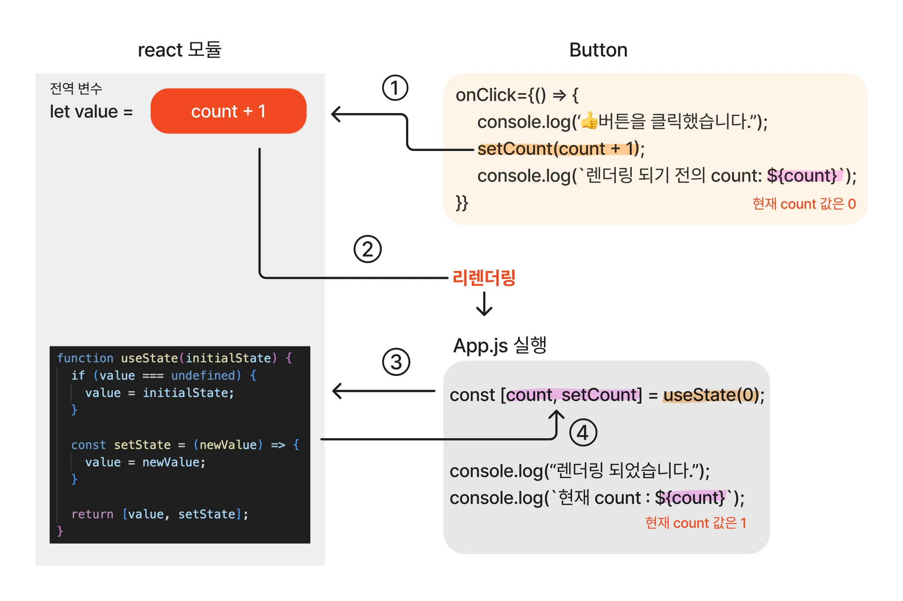

# useState 복습 및 응용

## useState란?

: 함수형 컴포넌트 내에서 state를 사용할 수 있게 해주는 '기본 hook'.

### state

: React 내에서의 state란 데이터가 관리 및 저장되는 공간.

#### class 및 function component의 대조
```jsx
// 클래스형 컴포넌트

class Product extends React.Component {
  constructor(props) {
    super(props);
    this.state = {
      price: 1000;
    };
  }
}

// 함수형 컴포넌트
function Product() {
  const [price, setPrice] = useState(1000);
}
```

- 이상의 코드에서 함수혀 컴포넌트와 클래스형 컴포넌트 안에서 state를 사용한 예시를 확인할 수 있는데, 함수형 컴포넌트에서는 useState Hook을 사용하여 첫 번째 argument인 변수 price에 상태 값으로 1000의 initialValue를 넣어주었습니다.

- 반면에, 클래스형 컴포넌트는 this.state = {price: 1000};을 사용하여 price를 1000으로 초기화해주었습니다.

- state는 JS의 객체이며, 컴포넌트 안에서 관리됩니다. 컴포넌트는 자신의 state를 props를 통해 자식 컴포넌트에 전달하고 영향을 끼칠 수 있습니다. state를 가진 컴포넌트 외에 다른 컴포넌트는 접근할 수 없기 때문에 local, 혹은 캡슐화(encapsulation)이라고 부르기도 합니다.

* props

: props도 속성을 나타내는 데이터이면서, JS의 객체입니다. '컴포넌트 안에서 관리되는 state'오 ㅏ다르게 '컴포넌트에 전달한다'는 방식 상의 차이가 있습니다.

- React 컴포넌트들은 자신의 props를 자체적으로 수정해서는 안되며, 입력값에 대한 결과가 변함없이 동일한 순함수처럼 작동해야 합니다.

```jsx
function Introduce(props) {
  return <h1>나는 {props.color}색을 좋아해!</h1>
}

const root =
  ReactDOM.createRoot(document.getElementById('root'));
  const element = <Introduce color='초록' />;

root.rander(element);
```

1. <Introduce color='초록' />; element로 root.render()를 호출합니다.
2. props로 {color: '초록'} 단일 객체를 Introduce 컴포넌트에 호출되어 전달 받고, 화면에는 Introduce 컴포넌트가 반환한 값, 즉 '나는 초록색을 좋아해!'가 나타납니다.

- 이상의 경우에서 해당 컴포넌트에 단일 객체로 전달한다는 표현이 있는데 이 '단일 객체'가 props에 해당합니다.

### setState

: 이상에서 state는 컴포넌트 안에서 관리되고 있는 저장되는 공간이라고 확인했습니다. state의 값을 갱신하기 위해서 함수형 컴포넌트와 클래스형 컴포넌트에서는 'setState'함수를 이용합니다.

형식 :

```jsx
<button onClick={ () => this.setState({price: this.state.price + 100})}>
가격 인상↑
</button>
```
클래스형 컴포넌트에서의 this.setState의 사용 예시

- React의 기본 Hook에 해당하는 setState 함수를 통해 '새 state 값을 반환받아서 컴포넌트 리렌더링을 큐에 등록하고 최신 state로 갱신'해줍니다. 또한 props와 동일하게 setState 함수로 동일성이라는 특징을 갖고 있어, '리렌더링 시에 변경되지 않습니다.'

### useState

이상까지의 예시들은 클래스 컴포넌트를 포함하여 설명이 이루어졌습니다. React Hook이 등장하기 전에, 함수 컴포넌트 안에서는 state 사용이 불가능했기 때문인데, 이제는 React 기본 Hook인 useState의 등장으로 함수 컴포넌트 안에서도 state를 사용할 수 있습니다.

- 이제 명심하셔야 할 것은 state와 useState는 다른 개념이었다는 점입니다.

useState의 특징 :

1. 상태를 유지하는 값인 state 변수와 그 값을 갱신하는 setState 함수를 쌍으로 반환.
2. useState 호출 시, 컴포넌트 state는 완전히 독립적으로 이루어져 작동됨.
3. 함수형 컴포넌트에서는 state의 initialValue로 객체를 포함한, 배열, 문자, 숫자 타입을 가질 수 있으며, 하나의 컴포넌트 안에서 여러 개의 useState Hook을 사용 가능.

```jsx
function Person() {
  const [age, setAge] = useState(18);         // number
  const [grade, setGrade] = useState('A');    // string
  const [todos, setTodos] = useState({subject: 'Math'});  // 배열/ 객체
  const [check, setCheck] = useState(false);  // boolean
  // 기타 추가 필드를 집어넣을 수 있을텐데, 이렇게 한 줄이 필드 및 setter 겠죠.
}
```
## useState를 사용하는 이유

: React에서 상태를 관리할 때 일반 변수가 아닌 state 변수를 활용하는 이유로는 DOM렌더링과 밀접한 관련이 있습니다.

### 일반 변수를 사용 했을 때

: 예를 들어 버튼을 클릭할 때 마다마신 물이 몇 잔인지 기록한다고 가정했을 때, 버튼의 클릭 횟수에 따라 변하는 상태를 저장할 수 있도록 일반 변수인 drink를 0으로 초기화하고, 버튼을 클릭하여 drinkwater 함수를 호출하면 drink 변수에 클릭 횟수가 누적되도록 하고, 출력할겁니다.

```jsx
function App() {
  let drink = 0;    // 일반 변수 사용
  const drinkwater = () => {
    drink += 1;
    console.log(`버튼 클릭 횟수 : ${drink}번`);
  };

  return (
    <>
      <p>
      🍶 오늘은 물을 <strong> { drink } </strong> 잔을 충전했습니다!!😊
      </p>
      <br/><br/><br/>
      <button onClick={drinkwater}>🍶</button>
    </>
  )
}
```
이상의 코드를 App10.jsx에 붙여넣고, 실행할 수 있도록 모드 과정을 작성하시오.

터미널도 사용. -> npm run dev : React Project를 실행시키는 명령어

이상을 해결했을 때, 콘솔창에서의 drink값이 변동이 있지만, 실제 화면에서는 변동된 값이 렌더링이 이루어지지 않고 있습니다.

이유 :

- 컴포넌트가 DOM에서 렌더링 될때 생명주기 이벤트가 발생하는 것에 있습니다. 함수 컴포넌트 안에서 일반 변수는 렌더링 될 때마다 초기화되지만, state 변수를 사용하는 경우 변경된 값을 반영하여 업데이트해주기 때문입니다.

### State 변수를 사용하게 됐을 때

- 그렇다면 useState를 사용하여 drink의 상태를 저장하게 됐을 경우

```jsx
import { useState } from 'react';
function App10() {
  const [drink, setDrink] = useState(0);

  const drinkwater = () => {
    setDrink(drink + 1);
  };

  return (
    <>
      <p>
      🍶 오늘은 물을 <strong> { drink } </strong> 잔을 충전했습니다!!😊
      </p>
      <br/><br/><br/>
      <button onClick={drinkwater}>🍶</button>
      {console.log(`버튼 클릭 횟수 : ${drink}번`)};
    </>
  )
}

export default App10;
```

### React가 useState 사용을 권장하는 이유

: 함수 컴포넌트는 state 변경으로 리렌더링이 되면 컴포넌트 내부에 있는 변수들이 모두 초기화가 이루어집니다. 기존의 컴포넌트가 새로고침되는 것이 아니고, state의 최신 상태를 새로운 컴포넌트로 갱신해주는 것에 가깝다고 볼 수 있습니다.

useState는 상태 주기 메서드와 state를 함수 컴포넌트에서 사용할 수 있게 만들어주고, 함수의 특성을 활용하여 현재 상태 값을 가지고 있는 state 변수와 값을 변경시켜주는 setState 함수를 사용하여 배열을 반환해줍니다.


```jsx
const [state, useState] = useState(initialValue);
```

App11.jsx 생성


- 버튼을 클릭할 때마다 화면이 리렌더링 되면서 count 횟수가 증가합니다.
- 콘솔창을 통해 컴포넌트가 렌더링되고 count 변수의 값이 갱신되는데, 해당 과정을 풀이하자면

1. 처음 서버를 실행했을 때, 컴포넌트가 렌더링되고 초깃값이 담긴 count를 출력(저희는 f5를 통해서)
2. 이후 버튼을 클릭하면 setCount 함수가 호출되고 현재 시점의 count를 출력합니다.
  - 렌더링 전의 count : 0 (해당 부분이 현재 시점의 count)
3. 렌더링이 된 후, 현재 시점의 count 값을 출력
  - 현재 count : 1 (이 부분이 바뀌고 난 부분이 됩니다.)

  느낌표\[임시이름](경로)

#### 클릭을한 후에 바로 count가 갱신될 것 같지만, 실제로는 버튼을 클릭한 이후에도 count 값이 그대로인 이유



1. setCount 함수가 호출되면 갱신할 값을 react 모듈 내 선언된 전역 변수에 할당.
2. 이후 컴포넌트가 리렌더링되고 다시 App.jsx가 실행됨. 그럼 초기값 0을 다시 useState에 전달하면서 useState 함수가 호출
3. 호출된 useState 함수는 먼저 react 모듈 내에 선언된 전역 변수에 값이 있는지를 확인 -> 값이 있다면 초기값 0이 무시됩니다. -> 그리고 전역 변수에 저장해두었던 count 값과 setCount를 반환
4. 반환받은 두 값은 각각 count 변수와 setCount 함수에 재대입

- 이상의 과정을 정리하자면, setCount 함수 자체는 현재의 state 변수르 변경시키는 것이 아니라, 리렌더링이 되고 난 이후의 useState가 반환한 값을 변경해주고, 컴포넌트를 리렌더링 시켜주게됩니다.

## useState를 응용

### useState와 이벤트를 사용한 로그인 폼 작성

App12.jsx 생성

```jsx
// 1. useState를 import

import { useState } from "react";

// 지금 현재까지는 컴포넌트들을 싸그리 다 분할했었는데, 다중 구조의 상위 컴포넌트오 하위 컴포넌트로 나누어서 작성하는 방법을 사용할 예정입니다.

// 2. LoginForm 함수 컴포넌트를 생성, 그리고 App도 만들겁니다.

function LoginForm() {
  const [id, setId] = useState('');
  const [password, setPassword] =useState('');

  return;
}

function App() {
  return (
    <div>
      <LoginForm />
    </div>
  );
}

export default App
```

- id / password라는 state 변수를 선언해줬습니다. 초기값으로 공백을 줬습니다. -> 나중에 input 사용할건데 빈칸으로 시작하기 위해서 해당 방법으로 처리했습니다.

```jsx
function LoginForm() {
  const [id, setId] = useState('');
  const [password, setPassword] =useState('');

  const handleLoginForm = (event) => {
    event.preventDefault();
  }

  return;
}

function App() {
  return (
    <div>
      <LoginForm />
    </div>
  );
}

export default App
```

3. 로그인 폼을 핸들링하는 함수 작성
- handleLoginForm에 event.preventDefault() 메서드 : form 안에 있는 submit 역할을 하는 로그인 버튼을 눌렀을 때 창을 새로고침하지 않도록 막는 역할.

- Event 인터페이스의 preventDefault() 메서드는 이벤트를 명시적으로 처리하지 않는 경우, 해당 이벤트에 대한 사용자 에이전트의 기본 동작을 실행하지 않도록 지정.


* 사용자 에이전트

사용자 에이전트(user agent)는 사용자를 대표하는 컴퓨터 프로그램으로, 웹 맥락에선 브라우저를 의미합니다.

브라우저 외에도, 웹 페이지를 스크랩하는 봇, 다운로드 관리자, 웹에 접근하는 다른앱도 사용자 에이전트입니다. 브라우저는 서버에 보내는 모든 요청에 사용자 에이전트(UA) 문자열이라고 부르는, 자신의 정체를 알리는 User-Agent HTTP 헤더를 보냅니다. 이 문자열은 보통 브라우저 종류, 버전 번호, 호스트 운영체제를 포함합니다.


```jsx
return(
    <form onSubmit={handleLoginForm}>
      <label>
        Id : 
        <input type="text" value={id} placeholder="아이디를 입력해주세요."/>
      </label>
      <label>
        Password : 
        <input type="password" value={password} placeholder="비밀번호를 입력해주세요."/>
      </label>
      <button type="submit">Login</button>
    </form>
  );
```

@react-refresh:267 Warning: You provided a `value` prop to a form field without an `onChange` handler. This will render a read-only field. If the field should be mutable use `defaultValue`. Otherwise, set either `onChange` or `readOnly`.
    at input
    at label
    at form
    at LoginForm (http://localhost:5173/src/App12.jsx?t=1740743683706:21:23)
    at div
    at App
(anonymous)	@	@react-refresh:267
performReactRefresh	@	@react-refresh:256
(anonymous)	@	@react-refresh:677
setTimeout		
(anonymous)	@	@react-refresh:666
validateRefreshBoundaryAndEnqueueUpdate	@	@react-refresh:728
(anonymous)	@	App12.jsx?t=1740742355331:53

- LoginForm에 return을 작성한 후에 이상과 같은 오류 메시지를 확인할 수 있습니다.
- id / password의 상태를 바꿀 수는 있지만, 아직 input 값을 입력할 수 없는 상태입니다.
- 즉, id와 password의 state만 선언해주었을 뿐, 어떤 동작을 하라고 지시하지 않았기 때문에 state 값을 변경시키기 위한 이벤트를 등록해주어야 합니다.

- input에 입력한 값을 React가 인지하고 동작할 수 있도록 onChange라는 이벤트를 발생시켜서 state 값을 변경시켜주어야 value값이 변경됩니다. 그러므로 form 태그 뿐만 아니라 id와 password 태그에도 각각 onChange라는 이벤트를 주기 위한 이벤트 핸들러 함수가 추가적으로 필요합니다.


```jsx
 const handleLoginForm = (event) => {
    event.preventDefault();
  };

  const handleIdInput = (event) => {
    setId(event.target.value);
  }
```

이상의 코드를 LoginForm 컴포넌트에 삽입하고, return의 input 부분에 onChange 속성에 각각의 함수를 작성함.

```jsx
// 1. useState를 import

import { useState } from "react";

// 지금 현재까지는 컴포넌트들을 싸그리 다 분할했었는데, 다중 구조의 상위 컴포넌트오 하위 컴포넌트로 나누어서 작성하는 방법을 사용할 예정입니다.

// 2. LoginForm 함수 컴포넌트를 생성, 그리고 App도 만들겁니다.

function LoginForm() {
  const [id, setId] = useState('');
  const [password, setPassword] =useState('');

  const handleLoginForm = (event) => {
    // console.log('로그인 버튼을 클릭했습니다.');
    event.preventDefault();
    alert(`Id: ${id} \nPassword: ${password}`);
  };

  const handleIdInput = (event) => {
    // console.log('아이디를 입력합니다.'); onChange의 흐름을 증명하기 위한 테스트 코드 
    setId(event.target.value);
  }

  const handlePasswordInput = (event) => {
    // console.log('비밀번호를 입력합니다.');
    setPassword(event.target.value);
  }

  return(
    <form onSubmit={handleLoginForm}>
      <label>
        Id : 
        <input type="text" value={id} placeholder="아이디를 입력해주세요." onChange={handleIdInput} />
      </label>
      <label>
        Password : 
        <input type="password" value={password} placeholder="비밀번호를 입력해주세요." onChange={handlePasswordInput}/>
      </label>
      <button type="submit">Login</button>
    </form>
  );
}

function App() {
  return (
    <div>
      <LoginForm />
    </div>
  );
}

export default App
```

# useRef 복습 및 응용

형식 :
```jsx
const ref = useRef(initialValue);
```

함수형 컴포넌트에서 useRef는 순수 JS 객체르 생성. 생성된 객체는
{current: initialValue}의 형태로 반환되기 때문에
ref.current의 형태로 값의 접근이 가능합니다(-> 어제 그래서 current 썼었습니다.)
따라서 useRef는 current 프로퍼티에 변경 가능한 값을 담고 있는 일종의 상자와 같다고 표현 가능합니다.

## useRef의 사용 목적
1. 특정 DOM에 접근하여 제어해야할 경우(어제 저희 document.title 사용했습니다)
2. 렌더링과 관계없이 값을 변경하고 싶을 경우

- JS의 경우 getElementById, querySelector 등의 메서드를 통해 DOM에 접근하여 제어가 가능합니다. 하지만 React의 경우에는 직접 DOM을 조작하는 것을 권장하지 않습니다.

- 그럼에도 불구하고 스크롤바 위치를 파악해야 하는 경우나, input 요소에 자동 포커스를 설정해 주어야 할 때처럼, 직접 DOM을 제어해 주어야 하는 예외적인 상황이 발생할 수 있는데, 이 때 useRef를 사용해 DOM에 접근할 수 있습니다.

* React에서 DOM 직접 조작을 권장하지 않은 이유

React는 DOM이 아니라 Virtual DOM을 사용하기 때문에 DOM 조작으로 인한 브라우저 렌더링을 최소화한다는 장점을 지니고 있는데, DOM을 직접 조작하게 된다면 React의 이상의 장점을 놓치는 일이 발생하기 때문에 권장하지 않습니다.

또한 useRef를 사용하여 반환된 객체{current : initialValue}는 컴포넌트의 전 생애주기를 통해 유지됩니다.

* 컴포넌트의 생애주기 : DOM에서 마운트되고 언마운트 되기 까지의 전 과정

useRef는 .current의 값이 변경되어도 컴포넌트 리렌더링을 '발생시키지 않고' 렌더링을 할 때 동일한 ref 객체를 제공합니다.

즉, 컴포넌트가 계속해서 렌더링이 되더라도 컴포넌트가 언마운트 되기 전까지는 값이 그대로 유지됩니다. 따라서 컴포넌트의 값의 변경은 관리해야 하지만 리렌더링을 발생시킬 필요는 없을 때 활용 가능합니다.

## useRef vs useState vs 일반 변수

### useRef vs. useState

- 두 개념 다 상태 관리를 위해 사용 가능.
- useState의 경우 state가 변경된 후에 리렌더링을 진행하지만,
- useRef는 리렌더링을 진행하지 않음. 내부적으로 값이 변하여 컴포넌트가 렌더링되기 전까지는 변경된 값이 보이지 않다가 렌더링이 되는 시점에 변경된 값이 보임.

- 이상의 차이로 인해 렌더링이 필요한 state의 경우에는 useState를 사용하는 용도와 생애주기 내내 변화하는 값을 가리키고 있다는 차이점이 존재합니다.

- 즉 useState는 컴포넌트의 생애 주기와 밀접한 연관이 있는 요소이므로 렌더링과 관련이 없는 값을 저장하기에는 적합하지 않으며, useRef는 state 렌더링과 무관한 값과 이전의 값을 저장하기에 적합하다고 할 수 있습니다.

- 우리가 해야할 것은 뭐다? 상황에 맞게 적절한 Hook을 선택해서 작성해야합니다.

### useRef 사용하기

App13.jsx 생성

```jsx
import { useState, useRef } from "react";
import './App.css'

// 매번 export default 작성하는데 바로 작성하는 방법도 한 번 이야기하겠습니다.

export default function App() {
  const [ statecount, setstateCount] = useState(0);
  const refCount = useRef(0);

  return (
    <div className="App">
      <button onClick={() => setstateCount(preCount => preCount + 1)}>
        State 버튼
      </button>
      <br/><br/><br/>
      <button onClick={() => refCount.current += 1}>
        Ref 버튼
      </button>
      <br/><br/><br/>
      <div>useState Count : {statecount}</div>
      <div>useRef Count : {refCount.current}</div>
    </div>
  )
}
```

이상의 코드에서 증명할 수 있는 점은 state 버튼을 누르게 되면 매번 useState Count 값이 1씩 증가하는 것을 확인할 수 있지만, Ref 버튼을 눌렀을 때는 useRef Count는 변경된 값이 렌더링이 일어나지 않고 있습니다.

그렇다면 useRef를 사용한 Ref Count 값은 병경이 실제로 일어나지 않는가? -> x

내부적으로는 카운트가 올라가고 있지만 화면에 바로 렌더링이 일어나지 않습니다.

그래서 State 버튼을 다시 눌러 리렌더링을 일으키게 됐을 때 변경점이 한꺼번에 나타난다는 점을 확인할 수 있습니다.

즉, state가 변화했을 때(useState에 해당하는 버튼을 눌렀을 때) refCount.current의 값도 같이 렌더링 됐음을 확인할 수 있습니다.

이상의 이유는 useRef로부터 생성된 객체는 component의 생애 주기 내내 변화하는 값을 가리키고 있기 때문에 current 값이 변화해도 리렌더링에 관여하지 않는다는 것에 있다고 볼 수 있습니다.

## useRef의 DOM

- useRef를 사용하는 특정 DOM에 접근하여 제어할 필요가 있을 때였습니다.
React에서 DOM을 선택하기 위해서는 ref를 사용하면 되는데, 어제 작성한 예시가 대표적입니다.

### useRef로 특정한 DOM 선택

App14.jsx 생성


```jsx
import { useRef } from "react";
import './App.css'

export default function App() {
  const textInput = useRef(null); // textInput {current: null}

  const ClickBtn = () => {
    console.log('클릭!');
  }

  const handleClickBtn = () => {
    console.log('useRef버튼 클릭!');
    textInput.current.focus();  // useRef가 가리키는 input 태그에 포커스 이벤트 적용
  }

  return (
    <div>
      <input type="text"/>
      <input type="button" value="ref x" onClick={ClickBtn}/>
      <br />
      <br />
      <br />
      <input type="text" ref={textInput} />
      <input type="button" value="ref o" onClick={handleClickBtn} />
    </div>
  );
}
```
