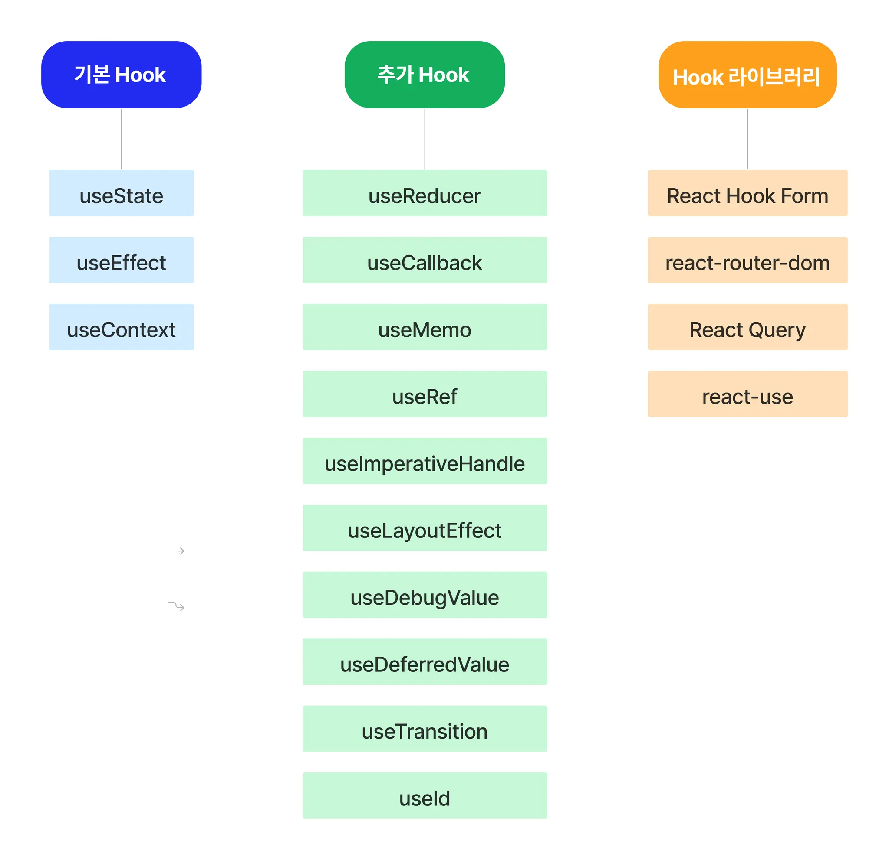
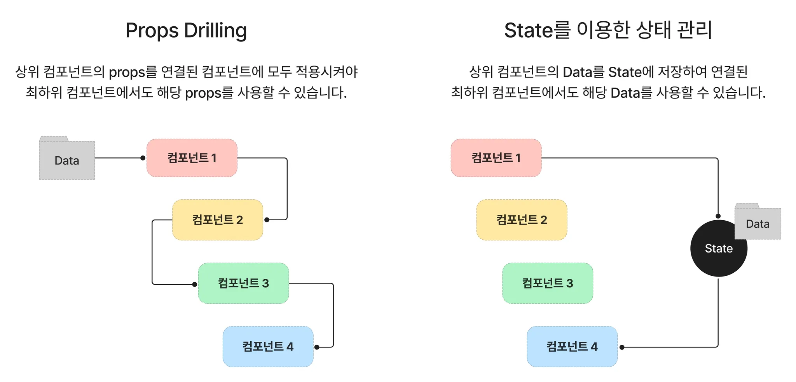
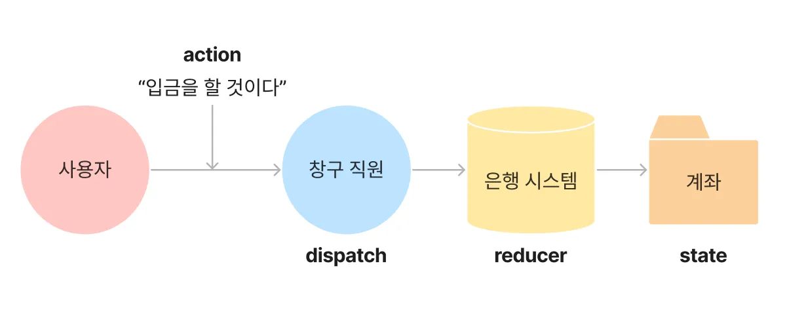

# 오류 수정

1. npm install uuid
2. Main 컴포넌트에 Button 컴포넌트 밑에
```jsx
    <main>
      <Button>레드벨벳 노래 찾기</Button>
      <Button>남자 아티스트 노래 찾기</Button>
      <Button>여자 아티스트 노래 찾기</Button>
      <KPopList />
    </main>
```
3. context.jsx

```jsx
  return (
    <KPopContext.Provider value={{data, playlist, setPlaylist}}>
      {children}
    </KPopContext.Provider>
  );
```

<KPopContextProvider value={{data, playlist, setPlaylist}}>
->
<KPopContext.Provider value={{data, playlist, setPlaylist}}>

# Hook

## 정의

: Hook은 함수 컴포넌트에서 상태 관리와 생명주기 기능을 연동할 수 있게 해주는 함수

함수 컴포넌트는 상태를 가질 수 없고, 메서드를 사용해 생명주기를 관리하는 것도 불가능. 기존에는 코드의 복잡성과 낮은 재사용성의 문제에도 불구하고 클래스 컴포넌트를 사용해야만 했습니다. 이후에 Hook이 등장하고, 효율적인 상태 관리 및 생명주기 기능을 사용할 수 있게 되었습니다.




### 기본 Hook vs. 추가 Hook

- 기본 Hook은 상태 관리와 생명주기 기능을 위해 가장 많이 사용됨.
- 추가 Hook은 기본 Hook을 변경하거나 특정한 경우에 필요에 따라 사용
- Hook 라이브러리를 참고하고, 미리 유용한 기능을 파악하면 Custom Hook의 필요성 여부를 따질 수도 있고, Custom Hook 제작시에 추가도 가능.

### Hook의 사용 이유
: 이상의 필기에서 함수 컴포넌트에서는 상태 관리 및 생명주기 메서드 사용이 x였기 때문에 로직의 재사용 및 구조 파악이 어렵고 코드가 복잡한 클래스 컴포넌트의 사용이 강제되었습니다.

```jsx
// 클래스 컴포넌트의 예시
class Example extends React.component {
  constructor() {
    super();
    this.state = {title: "example"};
  }
  render() {
    return <p>hello, {this.state.title}</p>
  }
}
```
클래스 컴포넌트는 render() 메서드를 반드시 포함해야 하고, render() 메서드 내부에 렌더링 하고 싶은 JSX 코드를 작성하는 구조였습니다. 또한, props를 조회하거나 상태를 업데이트하기 위해서 this 키워드를 활용하여 this.props / this.setState를 사용해야 했습니다. 

하지만 이후 함수 컴포넌트에서 상태 관리 및 생명주기 이벤트 사용이 가능하게 되었는데, 예시는 다음과 같습니다.

```jsx
// 함수형 컴포넌트 예시
function Example() {
  let [title, setTitle] = useState('example');

  return <p>hello, {title}</p>
}
```

### Hook 장점

1. 컴포넌트 간 상태 로직을 재사용 가능
2. 구조 이해가 클래스 컴포넌트에 비해서 간편함
3. 클래스 컴포넌트 없이 함수형 컴포넌트에서 사용 가능

#### 상태 관련 로직 재사용 가능
프로그램 작성시에 중복 코드를 쉽게 만나게 될 수 있습니다. 이 때 중복된 코드로 인한 불필요한 리소스를 줄이고자 상황에 따라 코드를 재사용합니다. 

기존의 클래스 컴포넌트를 기준으로 했을 때에는 Render props / 고차 컴포넌트(HOC, Higher Order Component)와 같은 재사용 패턴을 사용해야만 했습니다.

다음은 예시입니다.

```jsx
// 고차 컴포넌트를 통한 재사용
// 고차 컴포넌트
function withLogin(WrapperComponent) {
  return class extends React.Component {
    // 생성자 및 공통 상태 로직(아까 위에서 작성한 것과 유사합니다)
    constructor() {
      state = {
        user: []
      }
    }

    componentDidMount() {
      //비동기 작업 처리(데이터받아오기) 관련 코드
    }

    // 내부 컴포넌트 렌더링
    render() {
      return <WrapperComponent 
                {...this.state}
                {...this.props} />;
    }
  };
}

// 컴포넌트 재사용
function LoginPage ({ user }) {
  // 내려받은 user 데이터 사용하는 로직
}

export default withLogin(LoginPage); // 고차컴포넌트로 감싸주기
```

와 같은 과정을 거쳤습니다. 그런데 Hook의 등장 이후, Custom Hook을 통해 컴포넌트 간 상태를 저장하고 공유할 수 있게 되었습니다. 즉, 고차 컴포넌트 같은 패턴을 사용하지 않고도 Hook으로 컴포넌트를 재사용할 수 있게 되었습니다. 다음은 예시입니다.

```jsx
// Custom Hook으로 컴포넌트 재사용 예시
// Custom Hook
function useLogin() {
  const [user, setUser] = useState([]);

  useEffect(() => {
    // 비동기 작업 처리(데이터 받아오기) 로직
  }, []);

  return [user];
}

// 컴포넌트 재사용 
function LoginPage() {
  const [user] = useLogin();
  // useLogin() 컴포넌트를 재사용하여
  // 원하는 형태로 return을 구현한 사례
  return (
    <>
      {user.map(({num, email, name}, idx) =>{
        <div key={num}>
          <p>{email}</p>
          <strong>{name}</strong>
        </div>
      })}
    </>
  );
}
```

#### Props Drilling vs. State



state를 사용시에 데이터가 필요한 컴포넌트에 바로 사용이 가능하다는 점에서도 상태를 이용한 Hook의 장점이 많이 부각되었습니다.

여태까지의 수업을 통해 useState / useEffect / useContext를 작성해왔습니다.
그래서 금일 추가 Hook에 해당하는 useReducer에 대한 개념을 학습합니다.

# useReducer

: React에서 상태를 관리하는 '내장 Hook'으로, useState보다 복잡한 상태 로직을 다룰 때 유용한 기능.
특히 여러 개의 관련 상태를 다루거나, 상태 변경 로직이 복잡한 경우에 더 적합함.

## useReducer 사용 이유
- 여러 개의 상태가 서로 관련이 있거나, 복잡한 업데이트 로직의 필요시
- 액션 기반 업데이트 : 상태 업데이트를 '액션'을 통해 수행, 명확하고 예측 가능한 방식으로 상태 변경을 관리 가능
- 코드 가독성 향상 : 상태 변경 로직을 reducer 함수 안에 모아두기 때문에, 컴포넌트 내부의 코드가 깔끔해짐.
- Redux와 유사한 패턴 : useReducer는 Redux의 reducer 패턴과 유사하기 때문에 Redux 개념을 배우기 이전에 연습하기에도 좀 적절합니다.

## useReducer의 기본 구조
```jsx
const [ state, dispatch ] = useReducer(reducer, initialState);
```

- reducer : 상태를 업데이트하는 함수(순수 함수, 이하의 링크 참조)
https://ko.redux.js.org/usage/structuring-reducers/prerequisite-concepts/
- initialState : 초기 '상태' 값
- state : 현재 상태 값
- dispatch : 액션을 발생시키는 함수

### useReducer 사용 예제

npm create vite@4.3

usereducerapp

React
JavaScript

폴더 이동
npm install

npm run dev

.md 있는 폴더로 와서
git add .
git commit -m "feat: 20250318 usereducerapp started"
git push

그리고 이왕 저도 push하는 김에 링크 긁어와서 .md파일에 붙여넣어주세요.

Counter.jsx를 만들었습니다.

```jsx
import { useReducer } from "react";

// 1. 초기 상태
const initialState = { count: 0 }

// 2. reducer 함수(상태 변경 로직을 포함)
function reducer(state, action) {
  switch (action.type) {
    case "increment":
      return { count: state.count + 1 };
    case "decrement":
      return { count: state.count - 1 };
    default:
      return state;
  }
}

// 3. 컴포넌트 상에서의 useReducer 호출
export default function Counter() {
  const [ state, dispatch ] = useReducer(reducer, initialState);

  return (
    <div>
      <p>Count : {state.count}</p>
      <button onClick={() => dispatch({ type: "increment"})}>+</button>
      <button onClick={() => dispatch({ type: "decrement"})}>-</button>
    </div>
  );
}
```
1. initialState : count: 0으로 초기 상태 설정(자료형 고려할 것)
2. reducer 함수 : increment / decrement '액션'에 따라 count 값 변경
3. useReducer를 사용하여 state와 dispatch를 가져옴
4. dispatch({ type: "increment" })를 호출하면 상태 변경

해당 예시의 의의는 useReducer를 사용하는 방법에 해당합니다.
이상의 코드의 경우 저희가 useState를 통해서 충분히 쉽게 가져갈 수 있는데, reducer 함수 부분을 보시면 아시다시피 내부에 복잡한 로직이 들어가더라도 useReducer와 함께 모여있는 상태로 언제나 불러낼 수 있다는 점이 간단한 로직만 포함할 수 있는 useState에 비해 강점이 있다고 알아두시면 되겠습니다.

* 물론 저희는 count가 음수가 되는 상황도 건드리지 않았습니다...

### useState vs. useReducer

useState
- 사용목적 : 간단한 상태 관리
- 상태 변경 방식 : setState로 직접 변경
- 여러 상태 관리 : 여러 개의 useState 사용
- 상태 변경 로직 위치 : 컴포넌트 내부에서 관리

useReducer
- 사용목적 : 복잡한 상태 관리
- 상태 변경 방식 : dispatch를 통해 변경
- 여러 상태 관리 : 하나의 reducer에서 상태 관리 가능
- 상태 변경 로직 위치 : reducer 함수로 분리 가능

```jsx
// useState 사용
const [count, setCount] = useState(0);
<button onClick={() => setCount(count + 1)}>+</button>
// useReducer 사용
const [ state, dispatch ] = useReducer(reducer, {count: 0});
<button onClick={() => dispatch({type: "increment"})}>+</button>
```
근데 이상의 코드에서의 문제점은 reducer 함수 파트는 작성하지 않았다는 점입니다.
즉 간단하다면 당연히 기본 Hook에 해당하는 useState가 더 낫습니다.


이상의 그림은 useState를 예시화했습니다. 100원을 입금할 것이라는 요구 사항을 가진 사용자와 사용자의 계좌인 state가 존재하는데, 사용자는 입금을 하기 위해서 직접 계좌에 입금 내역을 작성해야한다고 볼 수 있습니다.


그리고 이상의 그림은 useReducer의 흐름을 은행으로 표시한 것으로, 사용자는 '입금하겠다'는 요구사항을 지니고 있으며, useState와 달리 창구 직원 / 은행 시스템이라는 중간자가 존재합니다. 이 때 사용자는 '입금'이라는 액션을 창구 직원에게 보내면 이를 은행 시스템에 전달하고 사용자 계좌의 state를 업데이트하게 된다고 볼 수 있습니다.

즉,
요구사항 : action
창구직원 : dispatch
은행시스템 : reducer
로 비유한 것으로 useReducer를 사용하게 될 경우 입금, 출금 및 다양한 일을 사용자가 직접 처리하지 않고 action으로 간단하게 처리할 수 있기 때문에 복잡한 state를 다루어야 한다면 useReducer가 더 좋은 선택이 됩니다.

그렇다면 복잡하다의 기준이 뭐길래 어떤 때는 useState / 다른 때는 useReducer를 사용하는가?

객체나 배열 같이 여러 개의 하위 값을 포함하는 복잡한 state를 가지거나 혹은 확장성이 있을 때에는 useReducer를 사용할 때 코드가 간결해지고 유지보수가 편리하다.


#### useState를 통한 복수의 함수 처리 예시

```jsx
import { useState } from "react";

export default function StateUse() {
  const [ count, setCount ] = useState(0);

  function down() {
    setCount(count - 1);
    console.log('사과를 1개 먹었습니다.');
  }

  function reset() {
    setCount(0);
    console.log('사과를 모두 먹었습니다.');
  }

  function up() {
    setCount(count + 1);
    console.log('사과를 1개 구매했습니다.');
  }

  return (
    <div>
      <p>현재 내가 가지고 있는 사과 개수는 {count} 개</p>
      <input type="button" value="🍎 1개 먹음" onClick={down} />
      <br />
      <br />
      <input type="button" value="🍎 1개 구매" onClick={up} />
      <br />
      <br />
      <input type="button" value="🍎 모두 먹음" onClick={reset} />
    </div>
  )
}
```

강사 염려 사항 : 이정도면 할만한데를 의도한게 아닙니다...

```jsx
import { useReducer } from "react";

function reducer(prevCount, action) {
  if(action === 'up') {
    return prevCount + 1;
  } else if ( action === 'down') {
    return prevCount - 1;
  } else if ( action === 'reset') {
    return 0;
  }

}

export default function ReducerUse() {
  const [ count, dispatch ] = useReducer(reducer, 0);
  // const 를 변경하기 위해서는 dispatch를 사용

  function down() {
    dispatch("down");
  }

  function up() {
    dispatch("up");
  }

  function reset() {
    dispatch("reset")
    console.log('다먹음')
  }

  // return은 동일하게 완성하시오.
  return(
    <div>
      <p>현재 내가 가지고 있는 사과 개수는 {count} 개</p>
      <input type="button" value="🍏 1개 먹음" onClick={down} />
      <br />
      <br />
      <input type="button" value="🍏 1개 구매" onClick={up} />
      <br />
      <br />
      <input type="button" value="🍏 모두 먹음" onClick={reset} />
    </div>
  );


}
```

### reducer란?

: 현재 state와 action 값을 전달 받아 새로운 state를 반환하는 함수

```jsx
// 현재 state, action을 매개 변수로 받음
function Reducer(state, action) => {
  return //구현부
}

//혹은 화살표 함수를 통해서
const Reducer = (state, action) => {
  return //구현부
}
```
#### action과 type
- action은 현재 state의 업데이트(상태를 변경)를 위해 필요한 정보를 담은 값으로 보통은 객체의 형태를 띱니다. 하지만 action의 값은 string이거나 number라도 상관없습니다(JS자료형으로 명시했습니다).

reducer의 로직은 action이 새로운 state를 계산하는 데 쓰이는지 확인하기 위해 action.type을 체크합니다. 이 때 action들이 분명한 의미를 가지고 유용한 정보를 주도록 설명하는 방식의 type 필드를 작성해야 합니다. 근데 안 쓸 때도 있습니다.

```jsx
switch (action.type) {
  // Reducer 함수로 전달된 action 객체의 값이
  // {type: 'LOGIN_SUCCESS'}라면 이하의 구문이 실행되도록 하는 예제
  case "LOGIN_SUCCESS":
      return {
        ...state,
        user: action.payload,
        isLogin: true,
        message: "로그인 성공!",
      };
      //기타 로직 관련
}
```
예를 들어 이상의 코드는 switch 코드를 사용하여 action 객체의 type 필드에 매핑되어있는 값, 즉 LOGIN_SUCCESS case에 따라 state를 업데이트합니다.(LOGIN_FAILED도 있을 수 있겠습니다)

### reducer 함수의 조건 - 순수 함수
: reducer를 순수 함수로 작성하는 이유는 개발자가 예상한대로 동작하는 것이 보장되록 하는 것에 목적이 있습니다. 
-> reducer 함수 내에서 reducer 함수 스코프 바깥의 변수를 수정하거나 사용해서는 안된다.
-> 함수 내에서 선언된 변수는 그 내부에서만 사용돼야 하고, 바깥(전역)의 변수의 값 대입 및 참조는 순수 함수가 아니다, 라고 해석할 수 있습니다.

* 순수함수(pure function ) vs. 비순수 함수(impure function)

순수함수의 의미 : 동일한 매개변수가 주어지면 항상 동일한 결과를 반환하는 함수.
  - 순수함수를 사용하면 부수 효과(side effect)가 발생하는 것을 방지할 수 있습니다.

```jsx
//순수 함수
function pureAdd(num1, num2) {
  return num1 + num2;
}

console.log(pureAdd(1, 2)); // 3
console.log(pureAdd(1, 2)); // 3
```
외부 환경에 의한 영향을 받지 않고, 주어진 argument가 같을 때 같은 결과를 반환

```jsx
// 비순수함수
let sideNumber = 10;

function impureAdd(num1, num2) {
  return num1 + num2 + sideNumber;
}

console.log(impureAdd(1, 2)); // 13

sideNumber = 20;
console.log(impureAdd(1, 2)); // 23
```
impureAdd 함수는 스코프 외부에서 선언된 sideNumber 변수가 impureAdd 함수에서 다뤄지고 있고, 주어진 argument가 같아도 다른 결과를 반환하므로 비순수함수에 해당함.

### reducer 함수의 조건 - 상태 변이(state mutation) 지양

state는 불변의 데이터 구조를 가져야합니다. 하지만 빈번하게 state의 원본을 수정하거나 추가, 혹은 덮어쓰는 방식을 사용할 경우 state 변이가 발생하게 됩니다.

문제 예시
기존의 state를 사용하던 다른 컴포넌트에서 에러를 발생시켜 리렌더링시에 예기치 않은 문제가
발생할 수 있습니다.

디버깅을 시도하더라도 state가 어디서 변경되었는지 알기가 어렵습니다.

이상의 문제를 해결하기 위해, 깊은 복사를 사용하여 업데이트한 state를 반환하여 기존 state를 대체합니다.

deep copy(깊은 복사) vs. shallow copy(얕은 복사)의 개념

* 깊은 복사 : 데이터(값) 자체를 복사하여 '다른' 주소값을 가지는 새로운 변수(혹은 객체)로 생성하는 것을 의미함.

상태 변이의 예시 /  깊은 복사의 예시
```jsx
function Reducer(state, action) {
  switch(action.type) {
    case: "LOGIN_SUCCESS":
      // 상태 변이의 사례가 여기서 나옵니다. -> 지양해야함
      state[user] = action.payload;
      state[isLogin] = true;
      state[message] = "로그인 성공";
      return state;
    // 그 다음 케이스 기타 로직
  }
}
```
```jsx
switch (action.type) {
  case "LOGIN_SUCCESS":
    // 깊은 복사를 통해 새로운 객체를 반환하는 사례 -> 지향합니다.
      return {
        ...state,
        user: action.payload,
        isLogin: true,
        message: "로그인 성공!",
      };
      //기타 로직 관련
}
```

### useReducer 중급 예제


src -> components 폴더 생성 -> LoginForm.jsx
src -> context 폴더 생성 -> Context.jsx
src -> reducer 폴더 생성 -> Reducer.jsx

App2.jsx 파일 생성 후에 기존의 App.jsx 전체를 다 복사해놓구요
App.jsx는 초기화합니다.

20250319 -> useState / useReducer 비교 대조 부분을 페이지 수준에서 다루어볼 예정
설문조사 네이버 폼 -> 내일 공지해서 월요일에 결과 발표
여러분들 성함 정도의 개인 정보를 받고 조별 과제 찬성 유무에 대한 조사만 할 겁니다.

조별 과제의 경우 3월 25일부터 조편성 및 회의
개별 과제의 경우 3월 25일 기준으로 제가 과제 형태를 정해놓고 제출해가면서 여러분만의 사이트를 만들어 나가는 과정을 목표로합니다.

git add .
git commit -m "feat: 20250318 useReducer page started"
git push

다 하시면 로그아웃