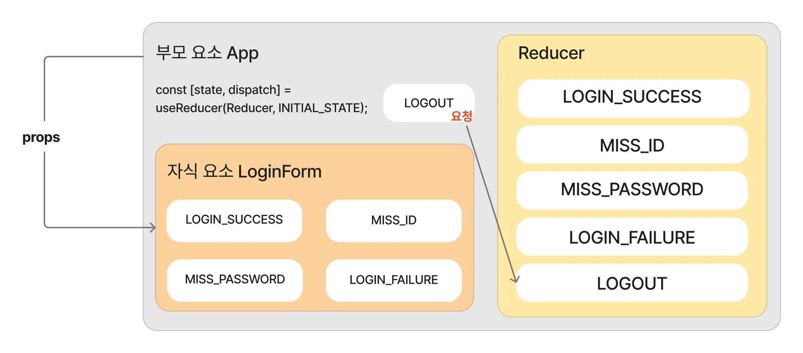
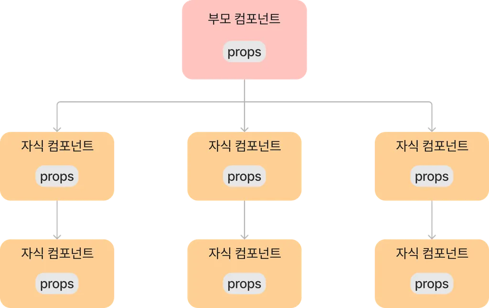
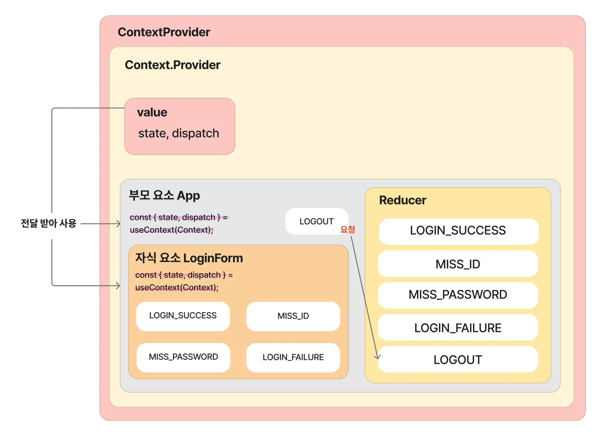

# useReducer / useContext 활용 예제

## useReducer의 문제점

: props drilling 문제가 있을 수 있다.


어제 저희가 작성한 예제에서 LoginForm 컴포넌트에서 state와 dispatch를 사용하기 위해 App 컴포넌트에서부터 props로 값을 내려보내줘야 했습니다.

```jsx
function App() {

  const [ state, dispatch ] = useReducer(Reducer, { isLogin: false, message : '', })  // 여기서 선언했고

  return (
    <div>
      {state.isLogin ? (
        <>
          <strong>welcome 🎈</strong>
          <button onClick={() => dispatch({type: "LOGOUT"})}>로그아웃</button>
        </>
      ) : (
        <LoginForm state={state} dispatch={dispatch} />   // 여기로 내려보내준 것을 이미지화했습니다.
      )}
    </div>
  );
}
```

이상의 코드가 App 컴포넌트에서 useReducer를 통해 생성한 state / dispatch를 LoginForm이라는 자식 컴포넌트에 전달한 코드 사례에 해당합니다.
그렇다면 상태관리도 하면서 props drilling의 문제를 해결하려면 어떡해야 할까?
-> useContext를 사용하면 된다.



이상의 이미지는 props drilling의 대표적은 도식화에 해당합니다. 즉 단계적으로 일일이 props를 넘겨줌으로써 해당 props를 사용하지 않는 컴포넌트 들에도 데이터가 제공되는 문제가 있습니다.

다만 저희는 부모에서 정의하고 바로 자식 컴포넌트에서 사용했습니다.


```jsx
import { createContext, useReducer } from "react";
import Reducer from "../reducer/Reducer";

const INITIAL_STATE = { isLogin: false, message: '' };

export const Context = createContext(INITIAL_STATE);

export const ContextProvider = ({ children }) => {
  const [state, dispatch] = useReducer(Reducer, INITIAL_STATE);

  return(
    <Context.Provider
      value= {{
        state,
        dispatch,
      }}
    >
      {children}
    </Context.Provider>
  );
}

export default Context;
```

useContext의 사용을 위해 Context.jsx에 이상과 같이 작성했습니다.
초기값으로 들어갈 상태를 INITIAL_STATE라는 상수 이름에 대입했습니다.
createContext 안에 넣어서, Context 객체를 생성했습니다.

ContextProvider 컴포넌트를 생성하고 useReducer 안에 첫 번째 argument로 reducer 함수(Reducer), 두 번째 argument로 INITIAL_STATE를 넣어서 전달합니다(provider).

ContextProvider 컴포넌트는 Context.Provider를 반환하는데, value 속성을 통해 하위 컴포넌트에 전달할 값을 지정해줬습니다.

```jsx
import { useState, useContext } from "react";
import Context from "../context/Context";

function LoginForm() {
  const [ id, setId ] = useState('');
  const [ password, setPassword ] = useState('');

  const { state, dispatch }  = useContext(Context);     // useContext(Context)의 리턴값은 객체입니다{} not []

  const userInfo = {
    id: 'react',
    password: 'qwer1234',
  };

  const handleLoginForm = (event) => {
    event.preventDefault();

    if (id === userInfo.id && password === userInfo.password) {
      dispatch({type: "LOGIN_SUCCESS", payload: userInfo});
    } else if (id !== userInfo.id && password === userInfo.password) {
      dispatch({type: "MISS_ID"});
    } else if (id === userInfo.id && password !== userInfo.password) {
      dispatch({type: "MISS_PASSWORD"});
    } else {
      dispatch({type: "LOGIN_FAILURE"});
    }
  };

  return(
    <form action="" onSubmit={handleLoginForm}>
      <label>아이디(ID)</label>
      <input type="text" 
        placeholder="아이디(ID)를 입력하세요 :)" 
        onChange={(event) => setId(event.target.value)}
        />
      <br />
      <br />
      <label>비밀번호(PASSWORD)</label>
      <input type="text" 
        placeholder="비밀번호(PASSWORD)를 입력하세요 :)" 
        onChange={(event) => setPassword(event.target.value)}
        />
        <br />
        <br />
        <button>Sign In</button>
        <br />
        <p>{state.message}</p>  
    </form>
  );
}

export default LoginForm;
```

useContext(Context)를 통해 Context를 호출하고 컨텍스트 내의 변수 state, dispatch를 사용할 수 있도록 선언.
만약 컨텍스트를 통해 받아온 state.Login이 true면 로그인이 된 상태이므로 welcome user를 렌더링하고, false라면 LoginForm을 실행시키도록 작성(App.jsx의 삼항연산자 부분).
이때 기존에는 state, dispatch를 LoginForm 컴포넌트에 props로 전달해야 했지만 useContext 적용 후에는 이상과 같이 코드가 바뀝니다.




### review useState / useReducer / useContext

지금까지 이상의 React Hook을 사용하여 로그인 폼을 작성해봤습니다.

그런데 이 이틀 이전에도 한 번 로그인 폼을 작성한 적이 있었는데
그때

```jsx
const [ id, setId ] = useState('');
const [ password, setPassword ] = useState('');
```
로 한 번 작성했구요,
```jsx
const [ user, setUser ] = useState({
    id: '',
    password: '',
})
```

# useMemo

useMemo에서의 Memo는 memoization을 의미합니다.

## 메모이제이션

: 연산의 결과값을 메모리에 저장해두고, 이전 렌더링에서 계산한 값과 현재 렌더링에서 계산한 결과값이 같은 경우, 다시 중복 연산을 해서 리소스를 낭비하는 일 없이 저장해둔 값을 재사용하여 성능 최적화를 하기 위한 기법.

예를 들어 함수A의 전체 실행시간이 (스레드 등을 이유로) 10초라고 가정했을 때, A 함수가 실행될 때마다 10초의 시간이 걸리게 됩니다. 그러나 메모이제이션을 통해 값을 저장하고 함수가 실행될 때 결과값만을 전달하여 재사용하게 된다면 연산을 줄일 수 있으므로 프로그램의 실행 속도에 유의미한 변화를 가지고 올 수 있습니다(빨라집니다).

```jsx
function calc(a, b) {
  return a + b;
}

// 함수형 컴포넌트
function MyComponent() {
  const result = calc(1, 2);

  return <p>{result}</p>
}
```

기본적으로 컴포넌트는 state가 변경되거나, props가 변경될 때마다 리렌더링이 되는데, 리렌더링이 될 때마다 MyComponent를 호출하게 되고 변수 result는 초기화되므로 매번 calc 함수를 실행합니다.

만약 calc 함수가 실행될때마다 10초 가량의 연산을 한다고 가정한다면
리렌더링이 세 번 일어났을 때 30초 가량의 연산이 수행되므로 매우 비효율적입니다. 이상을 이유로 useMemo를 사용하여 부하가 걸리는 함수의 결과값을 메모리에 저장한 뒤, 리렌더링이 될 때 함수를 호출해서 재연산을 하는 것이 아니라 결과값만을 가져와서 재사용함으로써 성능 최적화를 달성할 수 있습니다.

## useMemo의 기본 구조

```jsx
// 1. 빈 배열이 들어간 경우
const result = useMemo(() => calc(a, b), []);   // useEffect가 기억나면 좋겠습니다

// 2. element가 들어간 경우
const result = useMemo(() => calc(a, b), [item]);
```

useMemo()는 두 개의 argument를 받는데, 첫 번째 argument는 콜백 함수, 두 번째는 의존성배열(Array dependencies)이라고 불리는 배열을 가집니다. 

- 첫 번째 argument에 들어가는 callback 함수의 결과값은 useMemo의 return값으로 재사용하는 결과값이 됩니다.

두 번째 argument의 의존생 배열에 element가 들어갈 때는 의존성 배열의 return값이 변경될 때만 콜백 함수가 실행되는데, 이 때 렌더링 과정에서 배열 안의 element인 item 값이 변경되었는지를 확인하고, 값이 변경된 경우에만 콜백 함수를 동작시켜서 메모이제이션된 값만 다시 계산합니다.

따라서 useMemo는 의존성 배열에서 전달하는 값의 변경 여부에 따라 중복 연산을 최소화할 수 있으므로 컴포넌트의 성능을 최적화하는 것이 가능합니다.

### useEffect vs. useMemo

useEffect와 useMemo는 의존성 배열에 전달된 값의 변경 여부에 따라 콜백 함수의 실행 여부가 결정된다는 점에서 비슷한 점이 있습니다.

#### 차이점
1. useEffect는 '모든 렌더링이 완료된 이후 실행'되며, 렌더링 후 상태가 업데이트 되었을 때를 감지하여 동작하기 때문에 '리렌더링을 방지하지 못합니다.'

2. useMemo는 '렌더링 과정 중에 실행'됩니다. 렌더링 과정 중에 의존성 배열의 값이 변경되었는지를 확인하고, 값이 변경되었다면 이전에 저장한 값과 비교하여 값이 다른 경우에만 리렌더링 해줍니다. 따라서 useMemo는 메모이제이션 기법을 통해 불필요한 연산을 최소화하고 리렌더링을 막을 수 있으므로 렌더링 성능을 최적화할 때 사용합니다.

## useMemo를 사용 해보겠습니다.

npm create vite@4.3
usememoapp
React
JavaScript

폴더 이동
npm install

git add .
git commit -m "feat: usememoapp started"
git push

```jsx
import { useState } from 'react'
import './App.css'

function App() {
  const [ number, setNumber ] = useState(0);
  const [ text, setText ] = useState('');
  
  // 무거운 연산 수행하는 함수 정의 및 호출
  function heavyCalc() {
    let sum = 0;
    for(let i = 0 ; i < 1000000; i++) {
      sum += i;
    }
    return sum;
  }
  let calc = heavyCalc();
  console.log('반복수행중입니다');
  // number 값을 바꾸는 함수
  const increaseNum = () => {
    setNumber((prev) => prev + 1);  // 왜 setNumber(number +1);이 아니었는지 생각해주세요
  };

  const decreaseNum = () => {
    setNumber((prev) => prev - 1);
  };

  // text 값을 바꿔주는 함수
  const handleText = (e) => {
    setText(e.target.value);
  };

  return (
    <>
      <h4>✨ 반복적이고 무거운 연산값 </h4>
      <p>{calc}</p>

      <br />
      <br />
      <h4>✨ 숫자 바꾸기</h4>
      <button onClick={increaseNum}>+</button>
      <button onClick={decreaseNum}>-</button>

      <br />
      <br />
      <h4>✨ 문자 바꾸기</h4>
      <input type="text" onChange={handleText} />
      <br />
      <br />
      여기에 추가 컴포넌트를 작성한 다음에 넘겨줄겁니다
    </>
  )
}

export default App

```

이상의 App 컴포넌트에는 복수의 함수가 존재하는데, useMemo() Hook 증명을 위해 heavyCalc 함수를 정의하고, 호출까지 했습니다.

이상에서 0 ~ 10000000까지의 합을 구하는 반복문이 App 컴포넌트가 렌더링 될 때마다 일어나고 있음을 확인할 수 있습니다.

그 결과를 확인하기 위해서 console.log()를 통해 개발자 도구에서 확인도 가능하게끔 코드가 작성되어 있습니다.

두 번째로 increaseNum / decreaseNum 함수에서 중요한 점은
setNumber(number + 1) / setNumber(number - 1)으로 1씩 증가 및 감소를 작성하지 않고
setNumber((prev) => prev + 1) / setNumber((prev) => prev - 1)으로 작성했다는 점입니다.

이는 

```jsx
function triple() {
  setNumber(number + 1); 
  setNumber(number + 1); 
  setNumber(number + 1); 
}

return <button onClick={triple}>+3</button>
```
과 같은 의사 코드가 있다고 가정했을 때, 실제로 +3씩 되는 것이 아니라 +1씩 된다는 점에서 언급한 적이 있습니다.

그 이유는 이전 상태를 기준으로 클릭이 일어났을 때 렌더링을 하게 되는데, 이전 상태(예를 들어 1)에서 +1 한 값이 렌더링 한 번만 일어나기 때문에 +3이 아니라 +1이 된다는 점입니다. 이를 막고, 3씩 증가하는 것을 담보하기 위하여

```jsx
function triple() {
  setNumber((prev) => prev + 1);
  setNumber((prev) => prev + 1);
  setNumber((prev) => prev + 1);
}

return <button onClick={triple}>+3</button>
```
과 같이 작성할 수 있습니다.
즉 이전 상태를 매개변수로 받아 더한다는 점을 담보하는 부분이 화살표 함수가 되겠습니다.(vite 프로젝트 처음 생성시 참조)

```jsx
setCount((count) => count + 1); //으로 되어있습니다.
```
저희는 첫 수업 때 setCount((preCount) => preCount + 1);으로 수정했구요

```jsx
import { useMemo } from "react";

export default function ShowState({number, text}) {
  const consoleNumber = (number) => {
    console.log('숫자가 변경되었습니다');
    return number;
  }

  const consoleText = (text) => {
    console.log('문자가 변경되었습니다');
    return text
  };

  const showNum = consoleNumber(number);
  const showText = consoleText(text);

  return(
    <div>
      <p> 숫자 : {showNum} </p>
      <p> 문자 : {showText} </p>
    </div>
  )
}
```

이상의 ShowState 컴포넌트는 App.jsx에서 바꾼 값들을 출력해주고 값이 바뀔 때마다 console.log에 안내가 찍히도록 작성했습니다.

그리고 나서 페이지를 실행하면, + / - 버튼을 눌렀을 때, 그리고 input 창에 문자를 작성할 때마다 number / text가 바뀌는 것을 확인할 수 있는데, 느리게 렌더링이 일어납니다(그리고 방금 저는 멈췄었습니다).

이는 숫자와 문자를 바꿈으로써 화면이 리렌더링이 일어날 때마다 heavyCalc 함수가 실행되기 때문입니다.

근데 App 컴포넌트에 정의했던 반복문의 연산 결과값은 변하지 않는다는 점에 주목할 필요가 있습니다. -> 새로 연산할 필요가 없다.
이때 쓸 수 있는 것이 이전에 이미 계산한 값을 재사용할 수 있도록 하는 useMemo가 되겠습니다.


App.jsx의 heavyCalc 함수 실행문을 useMemo로 이하와 같이 감싸게 된다면
```jsx
const calc = useMemo(() => {
  return heavyCalc();
}, []);
```

여기도 작성하니까 숫자랑 문자만 바뀌고 있지  반복수행중입니다가 뜨지 않는 것을 봤을 때 useMemo()에 있는 부분이 렌더링이 일어나지 않고 있다는 점을 알 수 있습니다. 즉 App컴포넌트는 렌더링이 안일어나요.

increaseNum / decreaseNum을 실행하여 {number}의 값을 동적으로 바꾸더라도 반복 수행 중입니다는 뜨지 않고 
숫자가 변경되었습니다, 라는 문구와 문자가 변경되었습니다, 가 출력되는 것을 확인할 수 있습니다.

변경하고자 하는 state에 해당되지 않는 함수가 실행될 필요가 없을 것 같습니다.
(즉, increaseNum을 실행시켰는데 문자가 변경되었습니다가 뜰 필요가 없다는 의미입니다)

그렇다면 ShowState 컴포넌트에도 useMemo()를 적용할 수 있을 것 같습니다.

```jsx
const showNum = useMemo(() => consoleNumber(number), [number]);
```
이 힌트인데, 문자 부분도 동일하게 적용하여 ShowState 컴포넌트를 수정하세요.
import useMemo를 빼먹으면 안됩니다.

## useMemo 실습 예제

- useMemo를 사용하여 useEffect의 의존성 배열이 객체 타입일 때 생기는 참조 동일성 문제를 해결하는 방식을 코드로 풀이할겁니다.

방금과 마찬가지로 문제 상황을 코딩하고, 증명하고, 해결 방안을 풀이하는 방식으로 진행될 예정입니다.
 
git commit -m "feat: 20250320 useMemo task"
git push

로그아웃하고
종료